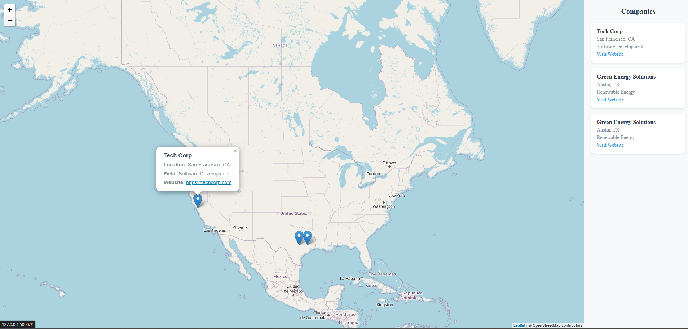

# Interactive Company Map

An interactive web application built with Flask and Leaflet.js that displays company locations on a map with detailed information. The application features a full-screen map view with a scrollable sidebar containing company listings.

## Screenshot



## Features

- Full-screen interactive map with company location markers
- Scrollable sidebar with company cards
- Company information popups on marker click
- Interactive company cards that center the map on click
- Responsive design that works on all screen sizes

## Tech Stack

- Backend: Python Flask
- Frontend: HTML, CSS, JavaScript
- Map: Leaflet.js
- Data Storage: JSON

## Project Structure

```
company-map/
├── app.py              # Flask application
├── companies.json      # Company data
└── templates/
    └── index.html      # Main application template
```

## Installation

1. Clone the repository:
```bash
git clone https://github.com/yourusername/company-map.git
cd company-map
```

2. Create a virtual environment (recommended):
```bash
python -m venv venv
source venv/bin/activate  # On Windows: venv\Scripts\activate
```

3. Install dependencies:
```bash
pip install flask
```

## Running the Application

1. Start the Flask server:
```bash
python app.py
```

2. Open your browser and navigate to:
```
http://localhost:5000
```

## Data Structure

Add company data to `companies.json` using the following format:

```json
{
    "companies": [
        {
            "name": "Company Name",
            "location": "City, State",
            "coordinates": [latitude, longitude],
            "website": "https://company-website.com",
            "workField": "Industry Field"
        }
    ]
}
```

## Contributing

### Adding New Companies

1. Fork the repository
2. Add your company data to `companies.json`
3. Follow the existing JSON structure
4. Ensure coordinates are accurate
5. Submit a pull request

Example company entry:
```json
{
    "name": "Tech Corp",
    "location": "San Francisco, CA",
    "coordinates": [37.7749, -122.4194],
    "website": "https://techcorp.com",
    "workField": "Software Development"
}
```

### Development Guidelines

1. **Code Style**
   - Follow PEP 8 guidelines for Python code
   - Use consistent indentation (4 spaces)
   - Include comments for complex functionality

2. **Commits**
   - Write clear commit messages
   - Keep commits focused and atomic
   - Reference issues when applicable

3. **Pull Requests**
   - Provide a clear description of changes
   - Include screenshots for UI changes
   - Update documentation if needed

### Feature Requests

Open an issue with the following information:
- Clear description of the feature
- Use case for the feature
- Any technical considerations
- Potential implementation approach

## License

MIT License - feel free to use this project for your own purposes.

## Contact

For questions or support, please open an issue in the repository.

---

Remember to replace `yourusername` with your actual GitHub username and update any other placeholder information before using this README.
