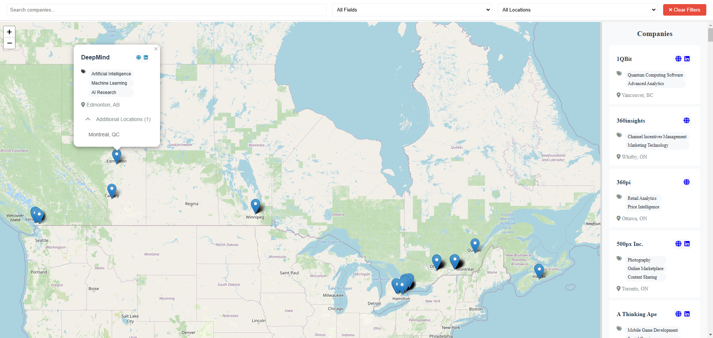

# Interactive Company Map

An interactive web application built with Flask and Leaflet.js that displays company locations on a map with detailed information. The application features a full-screen map view with a scrollable sidebar containing company listings.

## Demo video

Watch the video [**Direct**](https://github.com/icecore2/tech-map-canada/raw/main/example.mp4) OR [**Youtube**](https://youtu.be/WOATlpXuUco).


## Screenshot



## Features

- [x] Full-screen interactive map with company location markers.
- [x] Scrollable and resizable sidebar with company cards.
- [x] Company information popups on marker click.
- [x] Interactive company cards that zooming the company on the map when click.
- [x] Responsive design that works on all screen sizes.
- [x] Search bar on top of the page.
- [x] Filtration options: Location, Work field.
- [x] Work field clickable and sets the filter when clicked.
- [x] Work field and location filters.
- [x] Add Mouse over a company card changes color of the company pin.

## Tech Stack

- Backend: Python Flask
- Frontend: HTML, CSS, JavaScript
- Map: Leaflet.js
- Data Storage: JSON

## Project Structure

```
company-map/ 
├── app.py                 # Flask application 
├── requirements.txt       # Dependencies 
└── static/ 
   └── images/             # Static images 
   └── companies.json      # Companies data 
   └── script.js 
   └── styles.css 
└── templates/ 
   └── index.html          # Main application template 
└── tools/ 
   └── duplicate_check.py  # Check duplicate companies. If duplicate found, it prints it. 
   └── old_json_to_new.py  # Use legacy json structure and convert to new structure.
```

## Installation

1. Clone the repository:
```bash
git clone https://github.com/yourusername/company-map.git
cd company-map
```

2. Create a virtual environment (recommended):
```bash
python -m venv venv
source venv/bin/activate  # On Windows: venv\Scripts\activate
```

3. Install dependencies:
```bash
pip install -r requirements.txt
```

## Running the Application

1. Start the Flask server:
```bash
python app.py
```

2. Open your browser and navigate to:
```
http://localhost:5000
```

## Data Structure

Add company data to `companies.json` using the following format:

```json
{
    "Company Name": {
      "description": "",
      "links": {
         "website": "https://company-website.com",
         "linkedin": "https://www.linkedin.com/company/company_name/"
      },
      "locations": [
        {
          "City, State": [latitude, longitude]
        }
      ],
      "workFields": ["Industry Field", "Industry Field 2"]
    }
}
```
## Data types in structure

| Key         | Type          |
|-------------|---------------|
| name        | str           |
| location    | str           |
| coordinates | list[int,int] |
| website     | str           |
| linkedIn    | str           |
| workField   | list[str]     |


## Contributing

### Adding New Companies

1. Fork the repository
2. Add your company data to `companies.json`
3. Follow the existing JSON structure
4. Ensure coordinates are accurate
5. Submit a pull request

Example company entry:
```json
{
    "Company Name": {
      "description": "",
      "links": {
         "website": "https://company-website.com",
         "linkedin": "https://www.linkedin.com/company/company_name/"
      },
      "locations": [
        {
          "City, State": [latitude,longitude]
        }
      ],
      "workFields": ["Industry Field", "Industry Field 2"]
    }
}
```

### Development Guidelines

1. **Code Style**
   - Follow PEP 8 guidelines for Python code
   - Use consistent indentation (4 spaces)
   - Include comments for complex functionality

2. **Commits**
   - Write clear commit messages
   - Keep commits focused and atomic
   - Reference issues when applicable

3. **Pull Requests**
   - Provide a clear description of changes
   - Include screenshots for UI changes
   - Update documentation if needed

### Feature Requests

Open an issue with the following information:
- Clear description of the feature
- Use case for the feature
- Any technical considerations
- Potential implementation approach

## License

MIT License - feel free to use this project for your own purposes.

## Contact

For questions or support, please open an issue in the repository.

---

Remember to replace `yourusername` with your actual GitHub username and update any other placeholder information before using this README.
